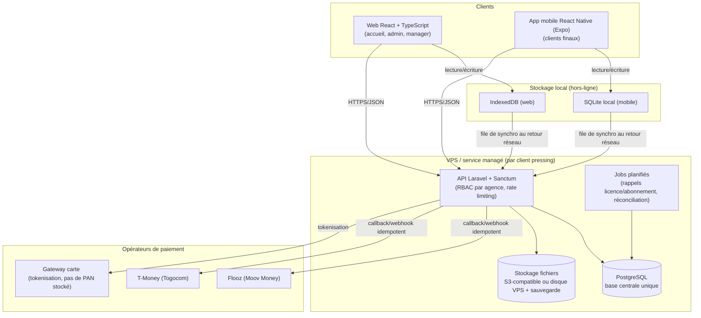
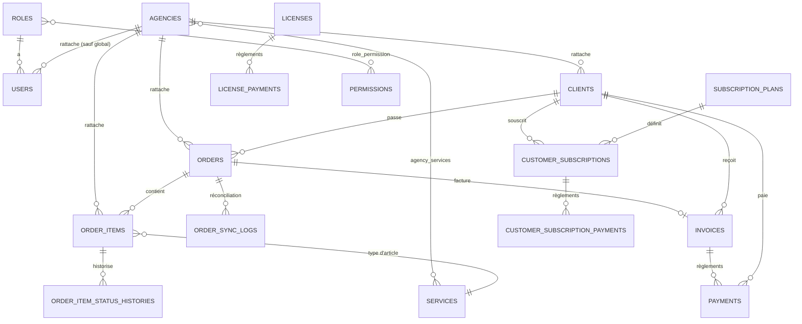

# Architecture — Système de gestion de pressing

Étape 1/7 du plan de développement. Ce document couvre uniquement l'architecture et le schéma de données — aucune route ni contrôleur API n'est implémenté à ce stade (voir Prompt 2).

## 1. Architecture globale



**Principes clés :**
- Une **base PostgreSQL par client pressing** (déploiement dédié) — pas de mutualisation multi-clients sur une même base (voir hypothèse H1).
- Le multi-agence est géré **à l'intérieur** d'un déploiement via `agency_id` sur chaque table métier.
- Le mode hors-ligne ne concerne que la création de commande et l'encaissement **espèces** à l'accueil ; les paiements carte/Mobile Money exigent une connexion active.
- Chaque webhook de paiement (Flooz, T-Money, gateway carte) est traité de façon idempotente (voir `payments.external_reference`, contrainte unique combinée à `method`).

## 2. Schéma de données (ER)



*(`AUDIT_LOGS` n'est pas représenté ci-dessus : table polymorphe append-only reliée à n'importe quelle entité via `auditable_type`/`auditable_id`.)*

## 3. Index

Définis directement dans les migrations (`database/migrations/`) :

| Table | Index / contrainte | Raison |
|---|---|---|
| `users` | `unique(email)`, `index(agency_id, role_id)` | Auth rapide, filtrage RBAC |
| `clients` | `unique(agency_id, phone)` | Un client identifié par téléphone au sein d'une agence |
| `agency_services` | `unique(agency_id, service_id)` | Un seul tarif par service et par agence |
| `orders` | `unique(agency_id, order_number)`, `index(agency_id, status)`, `unique(client_local_uuid)` | Numérotation par agence, filtrage par statut, idempotence hors-ligne |
| `order_items` | `unique(qr_code)`, `index(agency_id, status)` | Scan QR, suivi d'atelier |
| `invoices` | `unique(agency_id, invoice_number)` | Numérotation par agence |
| `payments` | `unique(method, external_reference)`, `index(agency_id, status)` | **Idempotence des webhooks** (rejouer un callback ne double-encaisse jamais) |
| `audit_logs` | `index(auditable_type, auditable_id)`, `index(created_at)` | Recherche d'historique, purge/rapports par période |
| `customer_subscriptions` | `index(client_id, status)` | Vérification rapide du quota actif |

## 4. Arborescence du projet Laravel

```
pressing_manager/
├── app/
│   ├── Models/
│   │   ├── Agency.php
│   │   ├── AuditLog.php
│   │   ├── Client.php
│   │   ├── CustomerSubscription.php
│   │   ├── CustomerSubscriptionPayment.php
│   │   ├── Invoice.php
│   │   ├── License.php
│   │   ├── LicensePayment.php
│   │   ├── Order.php
│   │   ├── OrderItem.php
│   │   ├── OrderItemStatusHistory.php
│   │   ├── OrderSyncLog.php
│   │   ├── Payment.php
│   │   ├── Permission.php
│   │   ├── Role.php
│   │   ├── Service.php
│   │   ├── SubscriptionPlan.php
│   │   └── User.php
│   ├── Http/            # Controllers, Requests, Middleware — Prompt 2
│   └── Providers/
├── database/
│   ├── migrations/      # schéma complet (étape 1)
│   ├── factories/       # UserFactory par défaut — factories métier en Prompt 2
│   └── seeders/         # à remplir en Prompt 2 (rôles, permissions, données de test)
├── docs/
│   └── ARCHITECTURE.md  # ce document
├── routes/              # api.php à remplir en Prompt 2
├── tests/               # PHPUnit/Pest — à remplir en Prompt 2
├── .env                 # DB_CONNECTION=pgsql, APP_LOCALE=fr
└── artisan
```

## 5. Hypothèses retenues

1. **Déploiement mono-client** : chaque pressing a sa propre base PostgreSQL (un VPS/conteneur dédié). Il n'y a donc pas de table `organizations` au-dessus d'`agencies` — la licence (`licenses`) porte sur le déploiement entier, pas sur une organisation précise en base.
2. **Un client final appartient à une agence** (`clients.agency_id`), même si une commande ultérieure peut en théorie être passée dans une autre agence du même réseau (le modèle l'autorise via `orders.agency_id` indépendant, mais ce n'est pas un flux mis en avant à ce stade).
3. **Tarification par agence** : `services` est un catalogue global, `agency_services` permet à chaque agence d'activer/désactiver un service et de surcharger son prix (utile si les tarifs varient selon la ville).
4. **Hors-ligne restreint** : seule la création de commande et l'encaissement espèces sont autorisés hors-ligne ; carte et Mobile Money nécessitent une connexion active (pas de file d'attente de paiement asynchrone, pour éviter tout risque de double-débit).
5. **Idempotence des paiements** : `payments.external_reference` + `method` forme la clé d'idempotence des callbacks Flooz/T-Money/carte ; `external_reference` est nul pour les paiements espèces (plusieurs `NULL` autorisés par la contrainte unique PostgreSQL).
6. **RBAC** : `role_id` est obligatoire sur `users` ; `agency_id` doit être nul pour un rôle à portée `global` (admin, manager global) et renseigné sinon. Cette règle est une contrainte applicative (validée dans le code métier du Prompt 2), pas une contrainte SQL — PostgreSQL ne permet pas nativement un `CHECK` portant sur une autre table.
7. **Articles non récupérés** : `agencies.unclaimed_item_threshold_days` fixe le délai par agence ; un job planifié (Prompt 6) fera passer `order_items.status` à `non_recupere` au-delà de ce délai plutôt qu'une contrainte en base.
8. **Stockage fichiers** : factures PDF, étiquettes QR et photos de preuve de livraison seront stockées via le disque Laravel `FILESYSTEM_DISK` — S3-compatible en production, disque local du VPS avec sauvegarde régulière en alternative low-cost. Seul le chemin (`invoices.pdf_path`) est en base, pas le binaire.
9. **Devise** : tous les montants sont des entiers en FCFA (XOF), qui n'a pas de sous-unité — pas de colonne `decimal`.
10. **Licence logicielle** : `licenses` ne contient que la licence courante (un déploiement = un client = une licence active à la fois) ; `license_payments` conserve l'historique complet des renouvellements.
